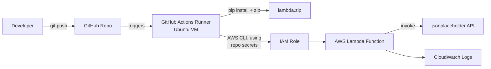

# AWS Lambda CI/CD Pipeline

A hands-on project to learn how to automatically build, package, and deploy a Python
AWS Lambda function using **GitHub Actions** — no manual zipping or uploading required.

## What this project does (in simple words)

Normally, deploying a Lambda function means: write code → zip it → open AWS Console
or run AWS CLI commands by hand → upload → repeat every time something changes.

This project automates all of that. Every time code is pushed to GitHub, a pipeline
wakes up on its own, installs everything the Lambda function needs, packages it into
a `.zip`, and pushes it straight to AWS Lambda — creating the function if it doesn't
exist yet, or updating it if it does.

Two branches are used to simulate two environments:

| Branch | Environment | Lambda function created |
|--------|-------------|--------------------------|
| `test` | Test        | `cicd_lambda_test`       |
| `main` | Production  | `cicd_lambda_main`       |

## Architecture



## Pipeline flow

```
git push
   ↓
main / test
   ↓
GitHub Actions (ubuntu-latest)
   ↓
actions/checkout
   ↓
actions/setup-python → Python 3.11
   ↓
Install jq + zip + boto3
   ↓
Set ENV / API_KEY / LOG_LEVEL   (prod if main, test otherwise)
   ↓
pip install requirements
   │
   └── manylinux2014_x86_64
       CPython 3.11 binaries      (Lambda-compatible wheels, not the CI machine's own)
   ↓
Package dependencies + app.py
   ↓
lambda.zip
   ↓
AWS CLI
   ↓
get-function
   ↓
Does Lambda exist?
   │
   ├── NO  → create-function (env vars set inline) ───┐
   │                                                    │
   └── YES → update-function-code                       │
                 ↓                                       │
              Poll status until "Successful"             │
                 ↓                                       │
          update-function-configuration (env vars)       │
                 ↓                                       │
                 └──────────────► Lambda function is live
```

## Project structure

```
AWS_LAMBDA_CICD/
├── .github/workflows/deploy.yml   # the CI/CD pipeline (GitHub Actions)
└── lambda_function/
    ├── app.py                     # the actual Lambda handler code
    └── requirement.txt            # Python dependencies (pandas, requests)
```

## What the Lambda function itself does

`app.py` is intentionally simple — it's a demo handler that:
1. Calls a public test API (`jsonplaceholder.typicode.com/posts/1`)
2. Loads the response into a pandas DataFrame and prints it (to prove packaging worked)
3. Prints out the `ENV`, `API_KEY`, and `LOG_LEVEL` environment variables the pipeline
   set, so you can see the test/prod values differ per branch
4. Returns a simple success response

## How to try it yourself

```bash
python3 -m venv .venv
source .venv/bin/activate

# work on a "test" environment branch
git checkout -b test
git push -u origin test
```

Pushing to `test` (or `main`) triggers the workflow automatically — check the
**Actions** tab on GitHub to watch it run.

## The debugging journey (STAR format)

Getting a "hello world" Lambda pipeline to actually work end-to-end turned out to
involve nine separate real bugs across five different layers of the stack: YAML,
bash, apt packaging, AWS CLI syntax, and Python/pandas runtime behavior. Framed as
a STAR story:

**Situation** — A GitHub Actions pipeline was supposed to package a Python Lambda
function and deploy it automatically on every push. The very first run failed, and
the GitHub UI only showed a generic message: `Process completed with exit code 100`
— no explanation of what actually broke.

**Task** — Get a pipeline that doesn't just report "success," but actually deploys
a Lambda function that runs correctly when invoked. A green checkmark that hides a
broken function isn't a finished job.

**Action** — Instead of guessing from the vague UI error, each failure was traced
back to the *actual* raw execution logs (`gh run view --log-failed`) to find the
real root cause, one layer at a time:

| # | Problem | Root cause | Fix |
|---|---------|------------|-----|
| 1 | `E: Unable to locate package python3.11` | `ubuntu-latest` moved to Ubuntu 24.04 (ships Python 3.12); `python3.11` isn't in its default apt repo | Used `actions/setup-python@v5` to pin Python 3.11 instead of apt |
| 2 | `[false: command not found`, pipeline always tried to *update* a function that didn't exist | Bash `if ["$VAR"=="value"]` written with no spaces — `[` is a command in bash and needs spaces around it | Rewrote as `if [ "$VAR" == "value" ]; then` |
| 3 | YAML parse errors inside `run: \|` blocks | Some lines indented *less* than the block's first line — YAML block scalars require consistent minimum indentation | Re-indented every line consistently |
| 4 | `No such file or directory` for the app folder and zip | Workflow referenced `Lambda_function` / `Lambda.zip`, actual files were lowercase `lambda_function` / `lambda.zip` — macOS ignores case, Linux runners don't | Made all names consistently lowercase |
| 5 | AWS CLI rejected `create-function` | Used `--zip_file` (underscore) instead of the real flag `--zip-file` (hyphen) | Corrected the flag |
| 6 | `actions/Checkout@v3` failed to resolve | GitHub Action names are case-sensitive (`checkout`, not `Checkout`) | Fixed casing |
| 7 | Prod/test env logic wasn't reliable | Same missing-space bracket issue as #2, in the branch-check `if` | Fixed with the same bracket-spacing correction |
| 8 | Pipeline went green, but the Lambda function crashed with `Unable to import required dependency numpy` | `pip install` on the GitHub Ubuntu runner downloaded a numpy binary built for Ubuntu, not for AWS Lambda's actual Amazon Linux execution environment | Forced `pip install --platform manylinux2014_x86_64 --only-binary=:all: --python-version 3.11` to fetch the Lambda-compatible wheel |
| 9 | `ValueError: If using all scalar values, you must pass an index` | The API endpoint (`/posts/1`) returns one JSON object (all scalar values), and `pd.DataFrame(data)` can't infer row count from scalars alone | Wrapped it as `pd.DataFrame([data])` so pandas treats it as one row |

**Result** — A fully working pipeline: every push to `test` or `main` now builds a
Lambda-compatible package, deploys it automatically, and the function runs
successfully end-to-end (verified with a real test invoke returning `StatusCode: 200`)
— not just a green checkmark, but a function that actually does what it's supposed to.

### How this maps to Amazon's Leadership Principles

| Leadership Principle | How it showed up here |
|---|---|
| **Dive Deep** | Never stopped at the GitHub UI's generic "exit code 100/254" message — pulled the actual raw logs every single time to find the real root cause instead of guessing. |
| **Ownership** | Didn't consider the job done when the pipeline turned green — kept testing the *actual* Lambda invoke and found (and fixed) two more runtime bugs that a "pipeline passed" status would have hidden. |
| **Insist on the Highest Standards** | Treated "the CI job succeeded" as necessary but not sufficient — the real bar was "the deployed function works when called," which required catching the numpy packaging mismatch and the pandas scalar bug. |
| **Learn and Be Curious** | Each failure came from a different unfamiliar layer (apt package naming, bash test-command syntax, YAML block-scalar indentation rules, manylinux wheel tags) — each was researched and understood rather than worked around blindly. |
| **Bias for Action** | Iterated in small, fast pushes — fix one bug, push, observe the real result, fix the next — rather than trying to design a "perfect" workflow up front before testing anything. |

## Tech stack

- **AWS Lambda** — serverless compute target
- **AWS CLI** — used inside the pipeline to create/update the function
- **GitHub Actions** — CI/CD automation (Ubuntu runner)
- **Python 3.11** — Lambda runtime + packaging environment
- **pandas / requests** — sample dependencies to prove packaging works end-to-end
