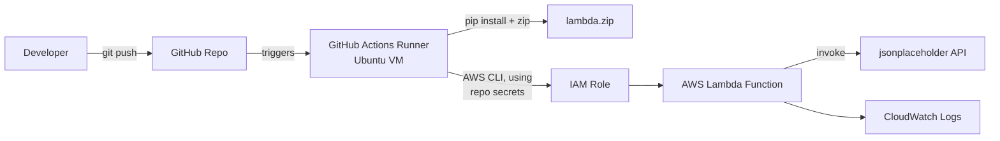
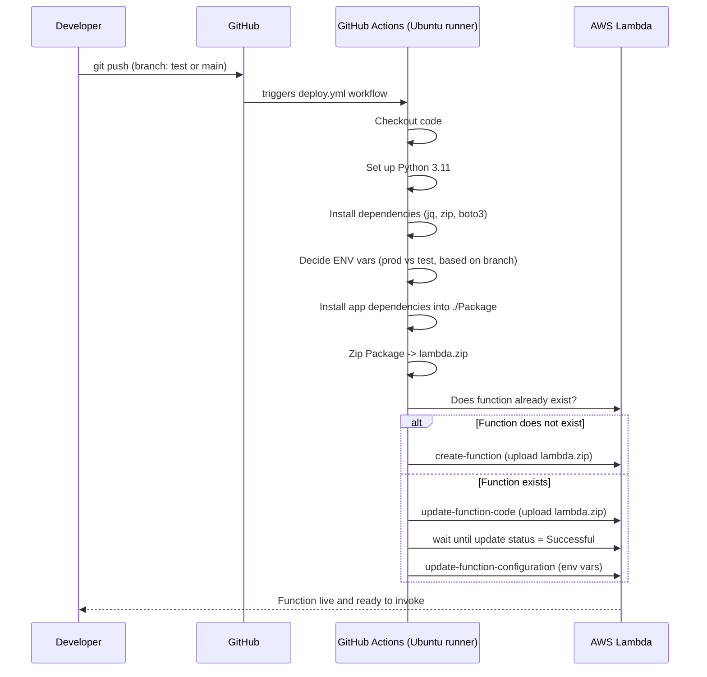

# AWS Lambda CI/CD Pipeline

A hands-on project to learn how to automatically build, package, and deploy a Python
AWS Lambda function using **GitHub Actions** — no manual zipping or uploading required.

## What this project does (in simple words)

Normally, deploying a Lambda function means: write code → zip it → open AWS Console
or run AWS CLI commands by hand → upload → repeat every time something changes.

This project automates all of that. Every time code is pushed to GitHub, a pipeline
wakes up on its own, installs everything the Lambda function needs, packages it into
a `.zip`, and pushes it straight to AWS Lambda — creating the function if it doesn't
exist yet, or updating it if it does.

Two branches are used to simulate two environments:

| Branch | Environment | Lambda function created |
|--------|-------------|--------------------------|
| `test` | Test        | `cicd_lambda_test`       |
| `main` | Production  | `cicd_lambda_main`       |

## Architecture



## Pipeline flow



## Project structure

```
AWS_LAMBDA_CICD/
├── .github/workflows/deploy.yml   # the CI/CD pipeline (GitHub Actions)
└── lambda_function/
    ├── app.py                     # the actual Lambda handler code
    └── requirement.txt            # Python dependencies (pandas, requests)
```

## What the Lambda function itself does

`app.py` is intentionally simple — it's a demo handler that:
1. Calls a public test API (`jsonplaceholder.typicode.com`)
2. Loads the response into a pandas DataFrame and prints it (to prove packaging worked)
3. Prints out the `ENV`, `API_KEY`, and `LOG_LEVEL` environment variables the pipeline
   set, so you can see the test/prod values differ per branch
4. Returns a simple success response

## How to try it yourself

```bash
python3 -m venv .venv
source .venv/bin/activate

# work on a "test" environment branch
git checkout -b test
git push -u origin test
```

Pushing to `test` (or `main`) triggers the workflow automatically — check the
**Actions** tab on GitHub to watch it run.

## Challenges faced while building this (and how they were fixed)

Since this was a learning project, most of the value came from debugging real
pipeline failures. Here's what went wrong and how each was diagnosed and solved:

| # | Problem | Root cause | Fix |
|---|---------|------------|-----|
| 1 | `E: Unable to locate package python3.11` — pipeline failed at "Install dependencies" | `ubuntu-latest` runner had moved to Ubuntu 24.04, which ships Python 3.12 by default. `python3.11` isn't in its default apt repo. | Stopped installing Python via `apt-get` entirely and used the official `actions/setup-python@v5` action to pin Python 3.11 — reliable no matter what Ubuntu version GitHub uses. |
| 2 | `line 10: [false: command not found`, and the pipeline kept trying to *update* a Lambda function that didn't exist yet | Bash `if` conditions were written as `if ["$VAR"=="value"]` with no spaces. In bash, `[` is actually a command, not a bracket symbol — it needs spaces around it and around `==`, otherwise bash tries to run a program literally named `[value` which doesn't exist. | Rewrote every condition as `if [ "$VAR" == "value" ]; then` (spaces after `[`, around `==`, and before `]`). |
| 3 | YAML parsing errors inside the `run: |` blocks | Some lines inside a multi-line shell script were indented *less* than the first line of the block. YAML block scalars require every line to be indented at least as much as the first line, or parsing breaks. | Re-indented every line inside each `run: |` block consistently. |
| 4 | `cd: Lambda_function: No such file or directory` and `zip file not found` when deploying | The workflow referenced `Lambda_function` and `Lambda.zip`, but the actual folder/file were `lambda_function` and `lambda.zip`. macOS (where the repo was written) ignores case, but the Linux GitHub runner does not. | Made all folder/file names consistently lowercase everywhere in the workflow. |
| 5 | AWS CLI errors on `create-function` | Used `--zip_file` (underscore) instead of the real AWS CLI flag `--zip-file` (hyphen). | Corrected the flag name. |
| 6 | `actions/Checkout@v3` failed to resolve | GitHub Action names are case-sensitive; the correct action is `actions/checkout@v3` (lowercase "c"). | Fixed the casing. |
| 7 | Branch/env logic wasn't reliable | The same missing-space bracket issue as #2 also affected the `main` vs `test` environment check, so it wasn't reliably picking the right `ENV`/`API_KEY`/`LOG_LEVEL` values. | Fixed with the same bracket-spacing correction. |

**Biggest lesson:** most of these failures weren't AWS problems at all — they were
small shell/YAML syntax mistakes that only show up once code runs on a real Linux
CI runner (case sensitivity, bracket spacing, indentation) rather than on a local
Mac terminal where some of these mistakes silently "work."

## Tech stack

- **AWS Lambda** — serverless compute target
- **AWS CLI** — used inside the pipeline to create/update the function
- **GitHub Actions** — CI/CD automation (Ubuntu runner)
- **Python 3.11** — Lambda runtime + packaging environment
- **pandas / requests** — sample dependencies to prove packaging works end-to-end
